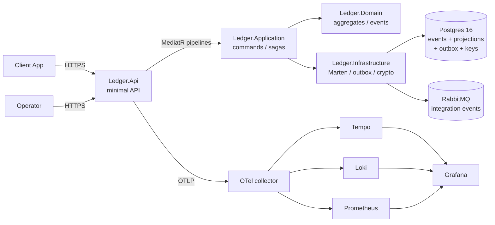

# ledger-core

[](https://github.com/popcom/ledger-core/actions/workflows/ci.yml)
[](https://github.com/popcom/ledger-core/actions/workflows/security-scan.yml)
[](LICENSE)
[](global.json)

A production-grade, event-sourced ledger service. Records money movement
with full auditability across accounts, transfers, and holds — the
kind of system you would find inside a neobank or a broker.

## What and why

`ledger-core` is opinionated about correctness:

- Money is a `decimal` value object that throws on currency mismatch.
- Aggregates are event-sourced; projections rebuild from the same events.
- Transfers are sagas with explicit compensation when the credit phase
  fails after the debit has already applied.
- Integration events leave through a transactional outbox.
- Subjects can be forgotten via per-subject crypto-shredding without
  rewriting the immutable audit log.

It is **not** a full banking system. No KYC, no card processing, no
real money rails. It is a defensible reference for "how do I build the
ledger spine?" the rest of those systems eventually call into.

## Architecture at a glance



More C4 diagrams in [`docs/diagrams/architecture.md`](docs/diagrams/architecture.md).

## Run in 60 seconds

```bash
docker compose up -d --build
```

Then open the API, run a transfer, read it back:

```bash
SRC=$(curl -fsS http://localhost:8080/v1/accounts \
    -H "Content-Type: application/json" \
    -H "X-Tenant-Id: acme" \
    -H "Idempotency-Key: open-src-$(uuidgen)" \
    -d '{"owner":"Alice","currency":"EUR"}' | jq -r .accountId)

DST=$(curl -fsS http://localhost:8080/v1/accounts \
    -H "Content-Type: application/json" \
    -H "X-Tenant-Id: acme" \
    -H "Idempotency-Key: open-dst-$(uuidgen)" \
    -d '{"owner":"Bob","currency":"EUR"}' | jq -r .accountId)

curl -fsS http://localhost:8080/v1/transfers \
    -H "Content-Type: application/json" \
    -H "X-Tenant-Id: acme" \
    -H "Idempotency-Key: tx-$(uuidgen)" \
    -d "{\"sourceAccountId\":\"$SRC\",\"destinationAccountId\":\"$DST\",\"amount\":25,\"currency\":\"EUR\",\"reference\":\"hello\"}"
```

Grafana lives at [http://localhost:3000](http://localhost:3000) (anonymous Admin enabled in the dev stack).

## Tech stack

| Concern             | Choice                                              |
| ------------------- | --------------------------------------------------- |
| Runtime             | .NET 10, C# 13                                      |
| Web                 | ASP.NET Core minimal APIs                           |
| Event store / DB    | Marten 8.x on PostgreSQL 16                         |
| Messaging           | MassTransit 8.x on RabbitMQ                         |
| Dispatch            | MediatR 12.x ([ADR-0006](docs/adr/0006-mediatr-over-wolverine.md)) |
| Validation          | FluentValidation                                    |
| Mapping             | Mapster                                             |
| Observability       | OpenTelemetry + Serilog                             |
| Local orchestration | Docker Compose (Aspire AppHost stub for now)        |
| Tests               | xUnit, FluentAssertions, NSubstitute, Testcontainers, Verify, FsCheck, ArchUnitNET |

## Architectural highlights

- [ADR-0001 — modular monolith](docs/adr/0001-modular-monolith.md)
- [ADR-0002 — event sourcing](docs/adr/0002-event-sourcing.md)
- [ADR-0003 — Marten over EventStoreDB](docs/adr/0003-marten-over-eventstoredb.md)
- [ADR-0004 — custom outbox table](docs/adr/0004-outbox-pattern.md)
- [ADR-0005 — conjoined tenancy](docs/adr/0005-multi-tenancy.md)
- [ADR-0006 — MediatR over Wolverine](docs/adr/0006-mediatr-over-wolverine.md)
- [ADR-0007 — per-subject crypto-shredding](docs/adr/0007-crypto-shredding.md)

## Testing strategy

| Lane                                     | Coverage                                       |
| ---------------------------------------- | ---------------------------------------------- |
| `Ledger.Domain.UnitTests`                | Aggregate rules, value-object arithmetic       |
| `Ledger.Application.UnitTests`           | Command handlers, pipeline behaviors, saga     |
| `Ledger.PropertyTests`                   | FsCheck invariants on the Account aggregate    |
| `Ledger.Infrastructure.IntegrationTests` | Marten round-trips, saga happy + compensation, crypto |
| `Ledger.ArchitectureTests`               | ArchUnitNET dependency rules                   |

CI runs unit + property + architecture by default; integration tests
are tagged `Category=Integration` and run when Docker is available.

## Observability

OpenTelemetry traces, metrics, and logs export over OTLP. The
docker-compose stack runs the OTel collector + Tempo + Loki +
Prometheus + Grafana out of the box, so you can drop into a Tempo
trace from a Prometheus dashboard with a single click.

## Performance

See [`docs/performance-report.md`](docs/performance-report.md) for the
baseline p50/p95/p99 numbers from the smoke and soak runs.

## GDPR / crypto-shredding

Per-subject AES-GCM-256 keys encrypt PII fields at write time. A
`POST /v1/privacy/forget/{subjectId}` deletes the key, rendering past
PII unreadable while preserving the immutable audit log. See
[ADR-0007](docs/adr/0007-crypto-shredding.md) for the rationale and
[`docs/runbooks/gdpr-forget-runbook.md`](docs/runbooks/gdpr-forget-runbook.md)
for the operator runbook.

## Trade-offs and what I'd change at 10× scale

The brief and the ADRs are explicit about what was rejected today and
why. Highlights:

- Per-subject crypto keys (not per-tenant): blast radius of a forget
  is exactly one subject.
- Custom outbox (not Marten's async daemon): integration events are
  saga outcomes, not 1:1 stream events.
- MediatR (not Wolverine): keeps the messaging story focused on
  MassTransit + RabbitMQ.
- Conjoined tenancy (not schema-per-tenant): one schema, one migration
  story, mechanical extraction path documented.

For the 10× plan, see the bottom of
[`docs/performance-report.md`](docs/performance-report.md).

## Roadmap and known limitations

- Snapshot-every-100 wiring for long-lived account streams.
- Async daily-statement projection table.
- MassTransit transport for the outbox (currently `LoggingOutboxTransport`).
- Aspire AppHost wiring once the workload lands in the default toolchain.
- Auth / authorization on `/v1/admin` endpoints.

## License

MIT — see [`LICENSE`](LICENSE).
