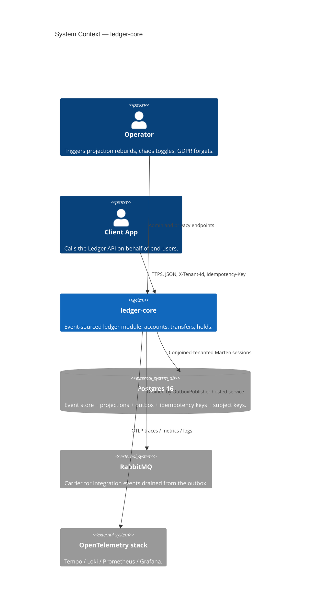
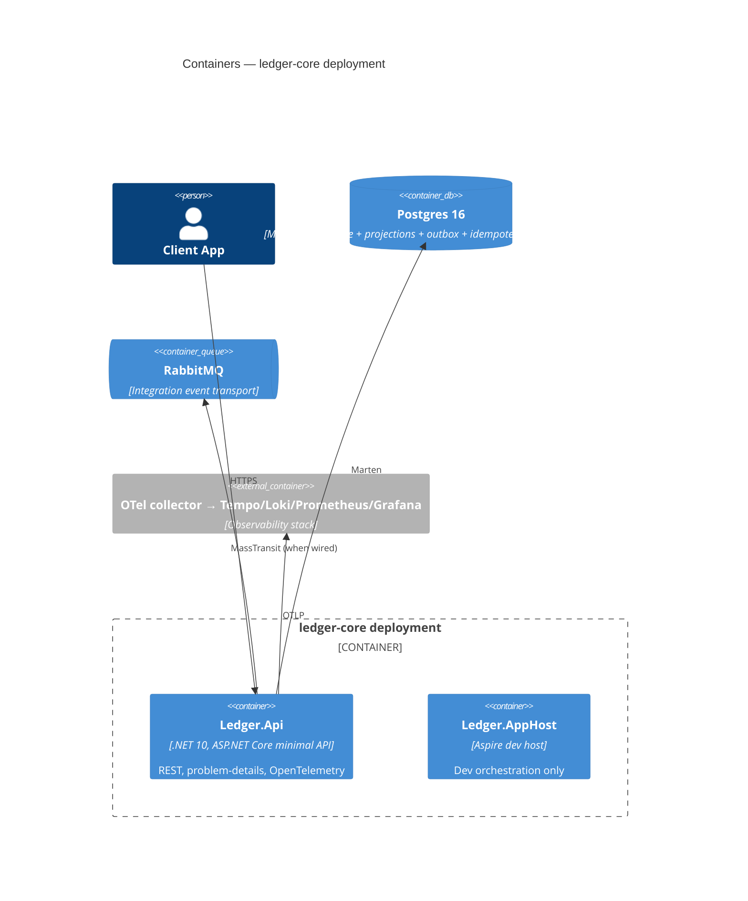
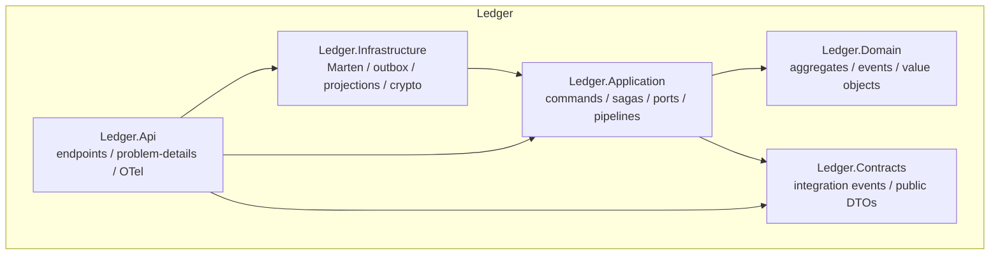

# Architecture diagrams

## C4 — System context



## C4 — Container diagram



## Module shape



## Transfer saga

```mermaid
sequenceDiagram
    participant Client
    participant Api as Ledger.Api
    participant Saga as InitiateTransferSaga
    participant Source as Account (source)
    participant Dest as Account (destination)
    participant Outbox as IOutbox

    Client->>+Api: POST /v1/transfers
    Api->>+Saga: InitiateTransferCommand
    Saga->>Source: Debit
    alt Debit fails
        Saga-->>Saga: Transfer.Fail (no compensation)
        Saga-->>-Api: Failed
    else Debit OK
        Saga->>Dest: Credit
        alt Credit fails
            Saga->>Source: Credit (compensation:*)
            Saga-->>Saga: Compensation completed
            Saga-->>-Api: Failed (compensated)
        else Credit OK
            Saga->>Outbox: TransferCompletedIntegrationEvent
            Saga-->>-Api: Completed
        end
    end
    Api-->>-Client: 201 Created / 200 OK
```
